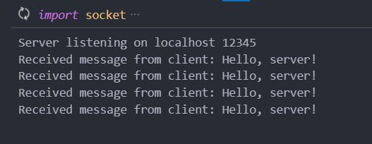
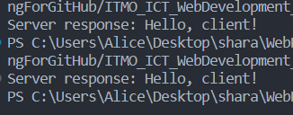

# Задание №1

Реализация клиентской и серверной части приложения, используя протокол UDP с помощью библиотеки socket.

## Клиент
```
import socket

server_ip = 'localhost'
server_port = 12345

sock = socket.socket(socket.AF_INET, socket.SOCK_DGRAM)

message = 'Hello, server!'

sock.sendto(message.encode(), (server_ip, server_port))

data, server_address = sock.recvfrom(4096)
response = data.decode()

print('Server response:', response)

sock.close()
```

## Сервер

```
import socket

server_ip = 'localhost'
server_port = 12345

sock = socket.socket(socket.AF_INET, socket.SOCK_DGRAM)

sock.bind((server_ip, server_port))

print('Server listening on', server_ip, server_port)

while True:
    data, client_address = sock.recvfrom(4096)
    message = data.decode()

    print('Received message from client:', message)

    response = 'Hello, client!'
    sock.sendto(response.encode(), client_address)
```

## Результат

Сервер
<figure>
  
</figure>

Клиент
<figure>
  
</figure>

В данной реализации клиент отправляет сообщение "Hello, server!" на сервер, который в свою очередь принимает сообщение и отправляет ответ "Hello, client!" обратно клиенту. Результат работы приложения отображается для каждой стороны. Применяется протокол UDP с использованием библиотеки socket.