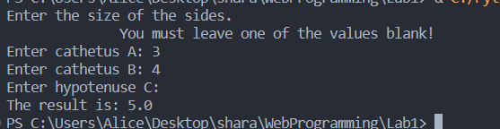

# Задание №2

Реализация клиентской и серверной части приложения, используя протокол TCP с помощью библиотеки socket.

## Клиент

```
import socket

def send_request(host, port, a, b, c):
    try:
        client_socket = socket.socket(socket.AF_INET, socket.SOCK_STREAM)
        client_socket.connect((host, port))

        request = f"{a},{b},{c}"
        client_socket.sendall(request.encode())

        result = client_socket.recv(1024).decode()
        print(f"The result is: {result}")

        client_socket.close()
    except ConnectionRefusedError:
        print("Can't connect to the server")

def start_client():
    host = 'localhost'
    port = 12345

    a = input('''Enter the size of the sides. 
              You must leave one of the values blank!\nEnter cathetus A: ''')
    a = float(a) if a else None
    b = input("Enter cathetus B: ")
    b = float(b) if b else None
    c = input("Enter hypotenuse C: ")
    c = float(c) if c else None

    send_request(host, port, a, b, c)

start_client()
```

## Сервер

```
import socket

def calculate_side(a, b, c):
    if a is None:
        return (c ** 2 - b ** 2) ** 0.5    
    elif b is None:
        return (c ** 2 - a ** 2) ** 0.5    
    elif c is None:
        return (a ** 2 + b ** 2) ** 0.5

def handle_client(connection):
    data = connection.recv(1024).decode()
    params = data.split(',')
    if len(params) != 3:
        connection.send(b"Invalid parameters")
    else:
        try:
            a = float(params[0]) if params[0] != "None" else None 
            b = float(params[1]) if params[1] != "None" else None 
            c = float(params[2]) if params[2] != "None" else None 
            result = calculate_side(a, b, c)
            connection.send(str(result).encode())
        except ValueError:
            connection.send(b"Invalid parameters")

    connection.close()

def start_server():
    host = 'localhost'
    port = 12345

    server_socket = socket.socket(socket.AF_INET, socket.SOCK_STREAM)
    server_socket.bind((host, port))
    server_socket.listen(1)

    print("Server started. Waiting for connections...")

    while True:
        client_socket, address = server_socket.accept()
        print(f"Connection established from {address[0]}:{address[1]}")

        handle_client(client_socket)

start_server()
```

## Результат

Клиент:
<figure>
  
</figure>

Сервер:
<figure>
  
</figure>

В данной реализации клиент запрашивает у сервера выполнение математической операции, в данном случае, рассчет теоремы Пифагора. Клиент вводит параметры с клавиатуры, и отправляет запрос серверу. Сервер обрабатывает полученные данные и возвращает результат обратно клиенту. Протокол TCP используется с использованием библиотеки socket.