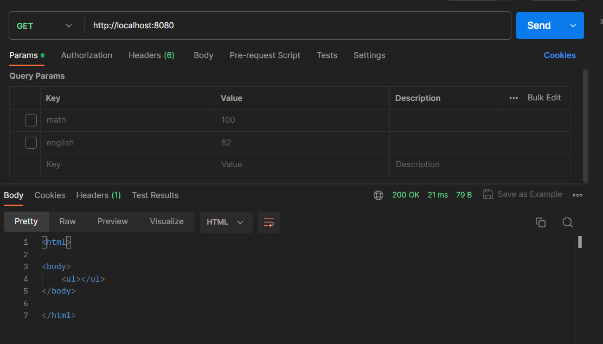
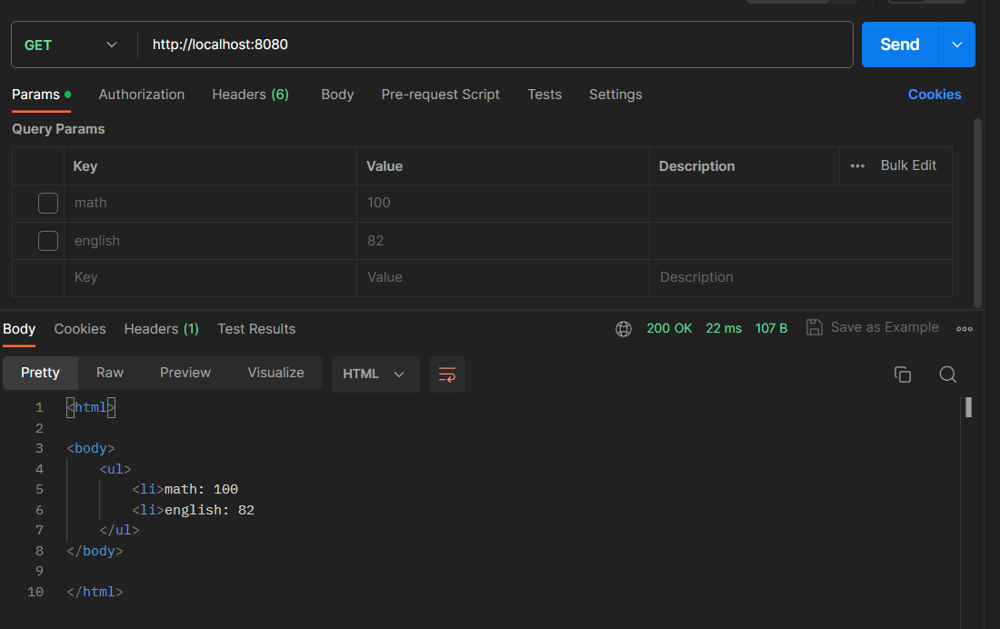

# Задание №5

Написание простого веб-сервера для обработки GET и POST HTTP-запросов с помощью Python и библиотеки socket.

## Сервер

```
import socket

class MyHTTPServer:

    def __init__(self, host: str, port: int):
        self.host = host
        self.port = port
        self.connect = socket.socket(socket.AF_INET, socket.SOCK_STREAM)
        self.connect.bind((host, port))
        self.connect.listen(1)
        self.grades = {}

    def serve_forever(self):
        while True:
            client, address = self.connect.accept()
            self.serve_client(client)

    def serve_client(self, client):
        data = client.recv(16384).decode()
        self.parse_request(client, data)

    def parse_request(self, client, data):
        lines = data.split("\n")
        method, url, version = lines[0].split()
        params = None

        if "?" in url:
            param_list = url.split("?")[1].split("&")
            params = {p.split("=")[0]: p.split("=")[1] for p in param_list}
        self.handle_request(client, method, params)

    def handle_request(self, client, method, params):
        if method == 'POST':
            disciplines = params.keys()
            for discipline in disciplines:
                grade = params[discipline]
                self.grades[discipline] = grade
            self.send_response(client, 200, "OK", "Data saved")
        elif method == 'GET':
            self.send_response(client, 200, "OK", self.grades_to_html_page())
        else:
            self.send_response(client, 404, "Not Found", "Wrong method.")

    def send_response(self, client, code, reason, body):
        response = f"HTTP/1.1 {code} {reason}\nContent-Type: text/html\n\n{body}"
        client.send(response.encode())
        client.close()

    def grades_to_html_page(self):
        page = "<html><body><ul>"
        for discipline, grade in self.grades.items():
            page += f"<li>{discipline}: {grade}"
        page += "</ul></body></html>"
        return page

if __name__ == '__main__':
    host = "localhost"
    port = 8080
    serv = MyHTTPServer(host, port)
    try:
        serv.serve_forever()
    except KeyboardInterrupt:
        serv.connect.close()
```

## Результат

GET-запрос до добавления данных
<figure>
  
</figure>

POST-запрос
<figure>
  
</figure>

GET-запрос после добавления данных
<figure>
  
</figure>

В данной реализации создается простой веб-сервер, который обрабатывает GET и POST запросы. При получении POST-запроса с информацией о дисциплине и оценке, сервер записывает эту информацию. При GET-запросе, сервер отдает информацию обо всех оценках в виде HTML-страницы. Реализация осуществляется с использованием модуля socket.