# Practice 3.1

###Вывести всех владельцев красных машин (или любого другого цвета, который у вас присутствует)

<figure>
  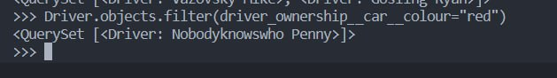
</figure>

###Найти всех владельцев, чей год владения машиной начинается с 2010 (или любой другой год, который присутствует у вас в базе)

<figure>
  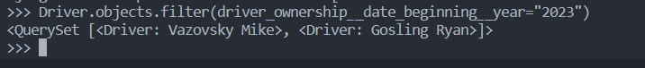
</figure>

###Напишите запрос на создание 6-7 новых автовладельцев и 5-6 автомобилей, каждому автовладельцу назначьте удостоверение и от 1 до 3 автомобилей. Задание можете выполнить либо в интерактивном режиме интерпретатора, либо в отдельном python-файле. Результатом должны стать запросы и отображение созданных объектов.

<figure>
  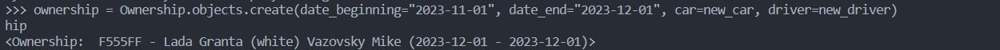
</figure>
<figure>
  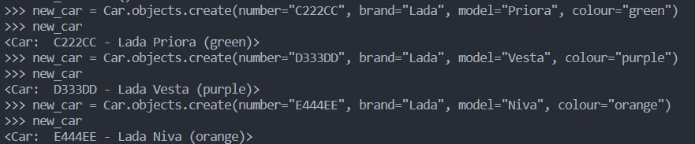
</figure>

###Взяв любого случайного владельца получить его id, и по этому id получить экземпляр удостоверения в виде объекта модели (можно в 2 запроса)

<figure>
  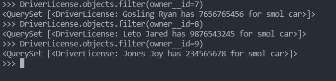
</figure>

###Найти всех водителей с именем “Олег” (или любым другим именем на ваше усмотрение)

<figure>
  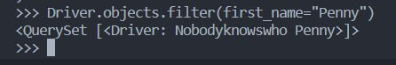
</figure>

###Выведете все машины марки “Toyota” (или любой другой марки, которая у вас есть)

<figure>
  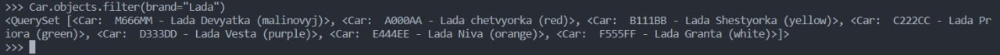
</figure>

###Вывод даты выдачи самого старшего водительского удостоверения

<figure>
  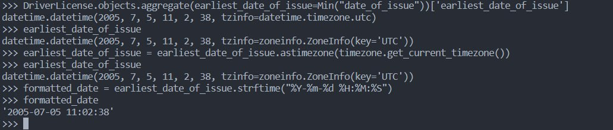
</figure>

###Укажите самую позднюю дату владения машиной, имеющую какую-то из существующих моделей в вашей базе

<figure>
  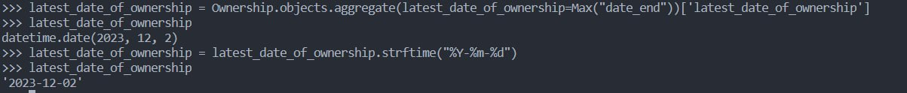
</figure>

###Выведите количество машин для каждого водителя

<figure>
  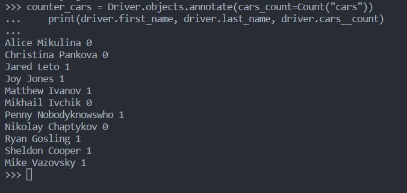
</figure>

###Подсчитайте количество машин каждой марки

<figure>
  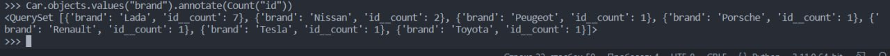
</figure>

###Отсортируйте всех автовладельцев по дате выдачи удостоверения

<figure>
  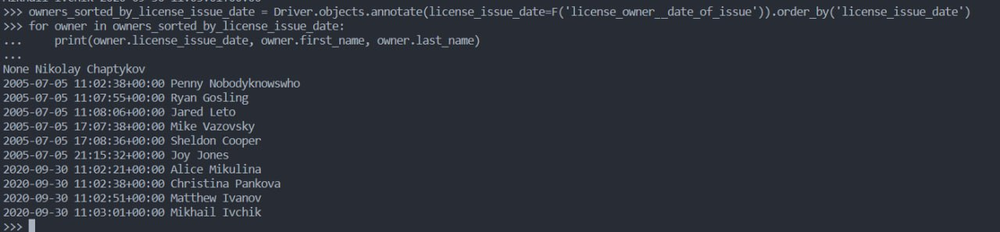
</figure>
